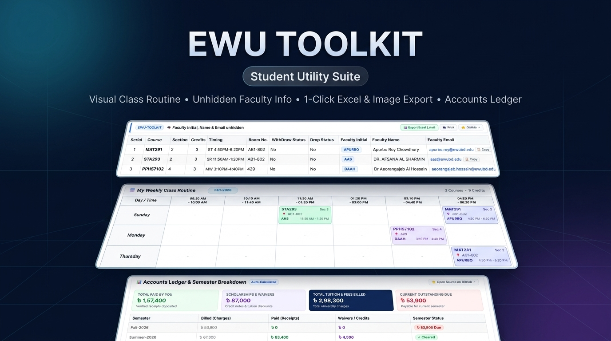
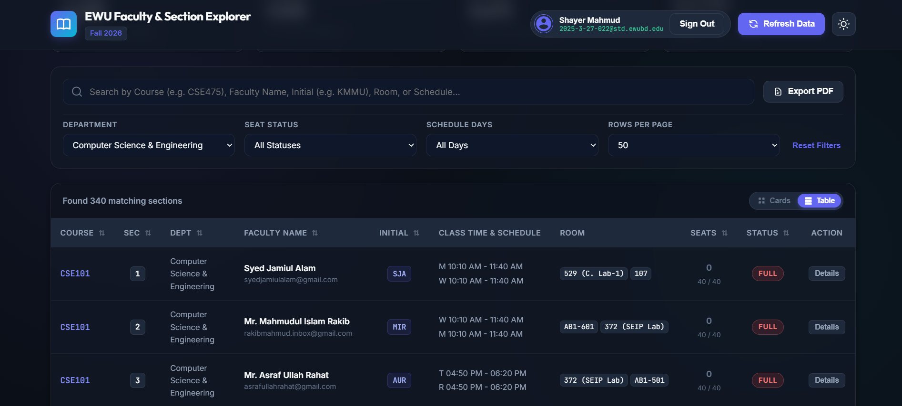
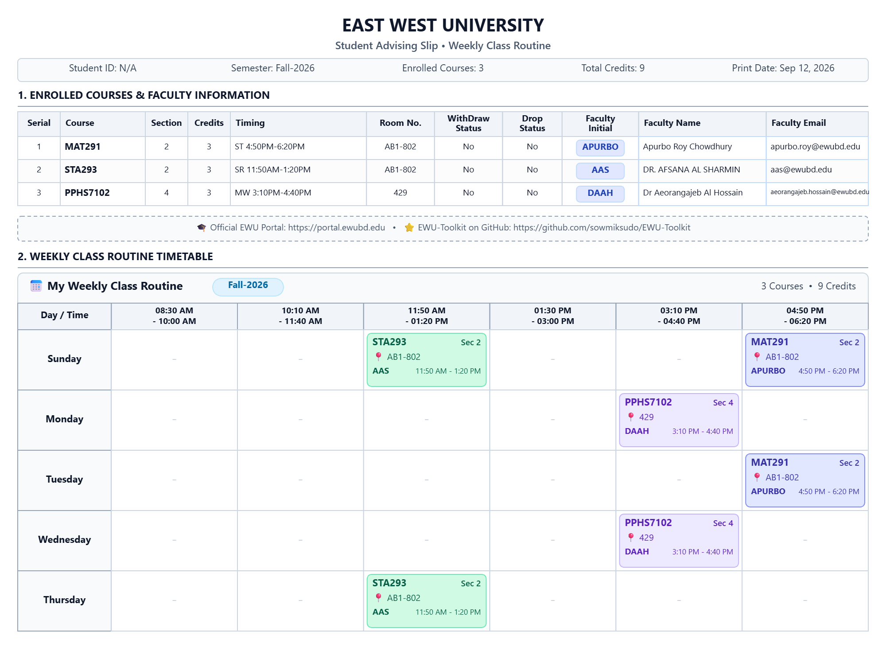

# 🎓 EWU-Toolkit

  

**EWU-Toolkit** is an open-source browser extension and userscript made by students, for students. It makes using the East West University student portal (`portal.ewubd.edu`) simpler, faster, and much more useful.

💖 **Open Source Project:** If this tool saves you time, please give it a ⭐ on [GitHub](https://github.com/sowmiksudo/EWU-Toolkit)!

---

## ⚡ 1-Click Install (Easiest Method - Tampermonkey)

> [!TIP]
> **Recommended:** Takes only 10 seconds and works across Chrome, Brave, Edge, Firefox, and mobile browsers (Kiwi / Orion)!

### 👉 [Click Here to Install Script](https://raw.githubusercontent.com/sowmiksudo/EWU-Toolkit/main/ewu-toolkit.user.js)

### Steps:
1. **Install the Tampermonkey extension** in your browser if you don't have it yet:
   - [Tampermonkey for Chrome / Edge / Brave](https://chromewebstore.google.com/detail/tampermonkey/dhdgffkkminghmkfafnlmfeedhkdaph)
   - [Tampermonkey for Firefox](https://addons.mozilla.org/en-US/firefox/addon/tampermonkey/)
2. **Click the install link:**
   - Click 👉 **[Install Script](https://raw.githubusercontent.com/sowmiksudo/EWU-Toolkit/main/ewu-toolkit.user.js)**
   - Tampermonkey will open a tab showing the script details.
   - Click the green **"Install"** button.
3. **Open EWU Portal:**
   - Log into [portal.ewubd.edu](https://portal.ewubd.edu) — all features will work automatically! 🎉

---

## 📦 Alternative: Install as Chrome Extension

If you prefer installing it directly as a browser extension without Tampermonkey:

1. **Download the Extension:**
   - Download the latest **`EWU-Toolkit-v1.3.0.zip`** from [Releases](https://github.com/sowmiksudo/EWU-Toolkit/releases).
   - Unzip the downloaded folder on your computer.
2. **Open Extensions in Chrome:**
   - Type `chrome://extensions` in your Chrome URL address bar and press Enter.
3. **Turn on Developer Mode:**
   - Toggle on the **"Developer mode"** switch in the top right corner.
4. **Load the Extension:**
   - Click the **"Load unpacked"** button in the top left.
   - Select the unzipped folder containing `manifest.json`.
5. **Done!**
   - You can pin the EWU-Toolkit icon to your browser toolbar for quick shortcuts!

---

## 📱 Native Android App (Instant Download)

Prefer using an app on your Android phone instead of a browser extension? EWU-Toolkit includes a lightweight native Android app:

### 👉 **[Download EWU-Toolkit Android App (APK)](https://github.com/sowmiksudo/EWU-Toolkit/releases/download/v1.4.0/EWU-Toolkit-v1.40.apk)**

* **1-Click Download**: Download the APK file (`app-debug.apk`) directly to your phone and install it (tap "Allow from this source" if prompted).
* **Pre-injected Toolkit**: Automatically loads `portal.ewubd.edu` with faculty reveal, visual routine timetable, seat counts, and ledger breakdown fully working out-of-the-box.
* **⚡ Dynamic Over-The-Air (OTA) Updates**: The app automatically fetches the latest toolkit scripts from GitHub in the background — no need to reinstall APKs for routine or style updates!
* **Native Android Integration**: Pull-to-refresh, hardware back button navigation, native system PDF printing (`PrintManager`), and direct file saving/sharing to Android's `Downloads` folder via the native Share Sheet.
* **Minimal Footprint**: Native Kotlin WebView with zero third-party bloatware (~5 MB).
* For developers or building from source, see [android/README.md](android/README.md).

---

## 🌐 Also Available: EWU Faculty & Section Explorer (Web App)

Looking for a dedicated web portal to browse, search, and plan course sections with faculty details before advising starts? Check out the **[EWU Faculty & Section Explorer](https://ewu-faculty-explorer.azurewebsites.net/)**:

### 👉 **[Launch EWU Faculty & Section Explorer](https://ewu-faculty-explorer.azurewebsites.net/)**

  

* 🔍 **Instant Search & Multi-Filters**: Search by Course Code (e.g. `CSE101`), Teacher Name, Faculty Initial (`MIR`, `SJA`, `AUR`), Classroom (`AB1-601`, `SEIP Lab`), or schedule timings.
* 📋 **Department & Seat Status Filters**: Narrow down sections by department, schedule days, and open/full seats.
* 🔀 **Cards & Table Views**: Easily switch between a high-density table and visual card layout.
* 📄 **1-Click PDF Export**: Download clean, print-ready PDF section overviews for offline planning.

> [!IMPORTANT]
> **🔒 Access Confidentiality & Prevention of Misuse:**  
> To protect institutional privacy, safeguard faculty contact details, and prevent automated web scraping or misuse by outside third parties, access to the Faculty Explorer web app **strictly requires logging in with your official East West University student account (`@std.ewubd.edu`)**. Only verified EWU students are granted access.

---

## ✨ Features (Explained in Simple Words)

### 1. 📅 Visual Weekly Class Routine & 1-Click Export (Image, Excel, PDF)
* **The Problem:** The advising slip is just a plain list of course rows without a calendar view, making it hard to see your breaks or daily routine.
* **What EWU-Toolkit does:**
  * Injects a **clean, colorful weekly timetable** right below your class schedule table.
  * Organizes your classes by **Day** (Sunday through Thursday / Saturday) and **Time slots**.
  * Shows course code, section, room number, faculty initial badge, and timings in distinct color cards.
  * Automatically flags any **⚠️ schedule clashes / conflicts** if two classes overlap.
  * Includes a sleek **"📥 Export ▾"** dropdown menu:
    * 🖼️ **Export as Image (.png)**: High-resolution PNG snapshot with tight, compact borders — ready to share on Discord, WhatsApp, or mobile.
    * 📊 **Export to Excel (.xlsx)**: Clean, styled native OpenXML workbook containing both your routine grid and course table.
    * 🖨️ **Print / Save as PDF**: Print-ready (`Ctrl + P`) formatted advising slip with clean headers and no clutter.

  

### 2. 🔍 See Teacher Names & Emails on Your Class Schedule
* **The Problem:** The university portal hides faculty names, initials, and emails on your class schedule and advising slip.
* **What EWU-Toolkit does:** 
  * Automatically reveals your teachers' **initials**, **full names**, and official **emails**.
  * Adds a handy **"📋 Copy"** button next to every email address so you can copy it in 1 click.
  * Clicking an email address opens your email app directly to write an email.
  * Everything stays visible when you press `Ctrl + P` to print or save your advising slip as a PDF.

  

### 3. 💺 Know How Many Seats Are Left & Hide Full Courses
* **The Problem:** During advising rush, you have to read confusing numbers like `28 / 30` to guess how many seats are left, while scrolling through dozens of full sections.
* **What EWU-Toolkit does:**
  * Displays easy color-coded badges for every course:
    * 🟢 **Green:** Open (e.g. `8 left`)
    * 🟡 **Yellow:** Almost full (`1 - 5 left`)
    * 🔴 **Red:** Full (`0 left`)
  * Adds a **"Show Open Sections Only"** checkbox at the top: check it, and all full courses disappear instantly so you only see what you can actually take!
  * Adds an **instant search bar** to filter courses by course code, room number, or time slot.

  

### 4. 📊 Understand Your Tuition Fees & Dues Easily
* **The Problem:** The student accounts ledger is a giant, confusing table of "Debit Notes" and "Credit Notes".
* **What EWU-Toolkit does:**
  * Adds a clean **financial summary** right above the table:
    * 💳 **Total Money Paid:** Sum of all your bank and online deposit receipts.
    * 🎓 **Scholarships & Waivers:** Total merit discounts and waivers granted to you.
    * 💰 **Total Tuition Billed:** Total university fees charged across all semesters.
    * ⚠️ **Current Due:** Exactly how much you need to pay for the current semester.
  * Shows a neat **semester-by-semester table** with green `✓ Cleared` badges for completed semesters and clear amounts for pending terms.

  

### 5. 🎛️ Extension Control Menu
* Click the extension icon anytime to:
  * Turn individual features on or off.
  * Quick-jump directly to Class Schedule, Offered Courses, or Accounts Ledger.
  * Check version info and open the GitHub project.

---

## 👥 Contributors

Thank you to all the students and developers who contribute to making **EWU-Toolkit** better!

Contributions of any kind (new features, bug fixes, UI improvements, or ideas) are warmly welcomed! Feel free to check out open [Issues](https://github.com/sowmiksudo/EWU-Toolkit/issues) or submit a [Pull Request](https://github.com/sowmiksudo/EWU-Toolkit/pulls).

---

## 📄 License

This project is open-sourced under the **[MIT License](LICENSE)**. 
- You are free to use, study, modify, and share this software.
- Provided "as-is" without warranty, created by and for the EWU student community.
